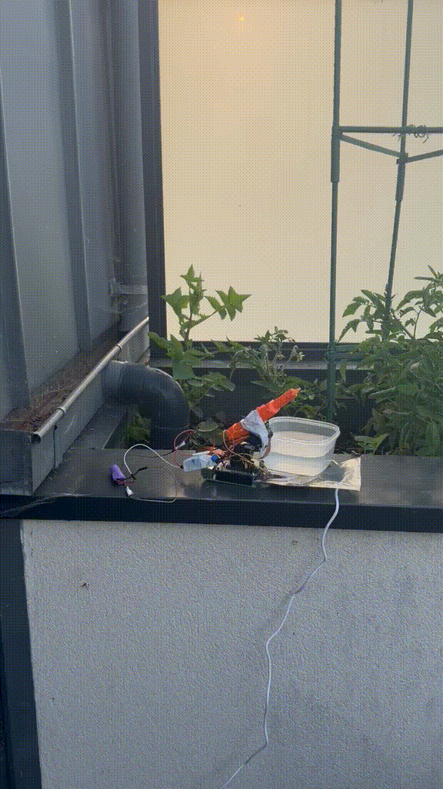

# GardenGuardian - Extended AI-assisted Pigeon Detection and Response

Système anti pigeon assisté par IA.

L'outil repose sur une caméra dont les images sont analysées par IA, avec un pistolet à eau automatique contrôlé par un relai. Cette approche permet de déclencher un tir d'eau sur les cibles détectées (ici, des pigeons).

Inspiré du thread [Reddit r/SideProject](https://www.reddit.com/r/SideProject/comments/1s9ywir/automated_pigeon_defense_system/) (nov. 2025).

**Phase actuelle : prototype fonctionnel** (pas de boîtier étanche).

Prochaines étapes si intérêt du public : création d'un boîter étanche, ajout de panneaux solaires pour en faire un système autonome.

## Démo




## Utilisation de l'IA

Outre l'utilisation de l'IA dans la partie analyse d'image, ce projet a été entièrement géré à l'aide de Claude.

Claude a permis de :
- déterminer le matériel à acheter
- préparer le câblage du matériel
- programmer le matériel
- préparer ce repo

J'ai utilisé GardenGuardian comme un projet test sur les capacités d'une IA à agir dans le monde physique lorsqu'elle est assistée par un humain, et je n'ai pas été déçu :).

## Matériel

**Pi 5 8GB → AI HAT+ Hailo-8 (26 TOPS) → Pan-Tilt HAT Waveshare WV16138 → Caméra Module 3** sur les servos pan/tilt.

- **Pi 5 8GB** + AI HAT+ Hailo-8 26 TOPS, Raspberry Pi OS Bookworm 64-bit
- **Caméra** : Module 3 standard (`imx708`), 75°, montée sur le pan/tilt
- **Pan-Tilt HAT Waveshare** : intègre le PCA9685 (I2C `0x40`, bus `i2c-1`) + 2 servos + capteur lumière TSL2581 (`0x29`)
- **Relais 1 voie à couplage optique** sur GPIO17 (actif-BAS : GPIO LOW = tir)
- **Pistolet à eau** OSDUE électrique USB : on intercepte uniquement les 2 fils de la gâchette (COM + NO du relais), la batterie ne passe jamais par le relais

## Pipeline

```
Caméra → Détection Hailo (YOLOv8) → si cible confiante :
  → vise le centre de la bbox via Pan-Tilt (PCA9685 / smbus2)
  → quand centrée (|err| < AIM_TOL) → relais GPIO → gâchette → jet d'eau
  → clip vidéo (pré + post tir) envoyé sur Telegram, puis cooldown
```

Détection live validée : GStreamer `libcamerasrc → 640×640 RGB → hailonet → hailofilter → appsink` (~30 fps).

## Utilisation

```bash
python3 track_bird_hailo.py --classe bird
```

Options : `--classe <coco>` (déf. `bird`, `person` pour tester en intérieur), `--no-fire` (suit sans tirer),
`--no-telegram` (pas de clip), `--dry-run` (détection seule). Ctrl+C coupe le pistolet et les servos.

**Arrêt d'urgence servos** (dès qu'un servo grince) :

```bash
python3 stop_servos.py
```

## Fichiers

| Fichier | Rôle |
|---|---|
| `track_bird_hailo.py` | Script principal : détection Hailo + visée + tir + clip Telegram |
| `servo_config.py` | Source unique : bornes/repos par axe, `us_to_ticks()`, `clamp_us()` |
| `servo_driver.py` | `ServoController` — pilotage PCA9685 via smbus2 |
| `watergun.py` | Déclenchement pistolet (GPIO17, actif-bas, rafale bornée à 3 s) |
| `telegram_notify.py` | Envoi clip/message Telegram |
| `set_servo.py` | Calibration manuelle d'un servo : `set_servo.py <canal> <us\|rest> [durée]` |
| `stop_servos.py` | **Arrêt d'urgence** : coupe le PWM des 16 canaux (servos mous) |
| `telegram_config.example.py` | Modèle de config Telegram (copier en `telegram_config.py`, **secret**) |

## Calibration servos (µs @ 50 Hz)

| Axe | Canal | min | max | repos |
|---|---|---|---|---|
| **Tilt** (vertical) | 0 | 400 | 1200 | 900 |
| **Pan** (horizontal) | 1 | 850 | 2650 | 1750 |

⚠️ Ne jamais commander hors `[min, max]` (le servo force sur sa butée et grince → risque de le griller).
Sens validés en live : `TILT_SIGN = +1`, `PAN_SIGN = -1`.

## Configuration Telegram

1. Créer un bot via [@BotFather](https://t.me/BotFather) → récupérer le token
2. Envoyer un message au bot, puis : `python3 telegram_notify.py chatid` → récupérer le chat_id
3. Renseigner les identifiants via les variables d'env `TELEGRAM_BOT_TOKEN` / `TELEGRAM_CHAT_ID`,
   **ou** copier `telegram_config.example.py` → `telegram_config.py` (ne pas committer)
4. Tester : `python3 telegram_notify.py test`

## Ressources

- [Docs Hailo Raspberry Pi](https://www.raspberrypi.com/documentation/computers/ai.html)
- [Docs picamera2](https://github.com/raspberrypi/picamera2)
- [Docs Pan-Tilt HAT Waveshare](https://www.waveshare.com/wiki/Pan-Tilt_HAT)
